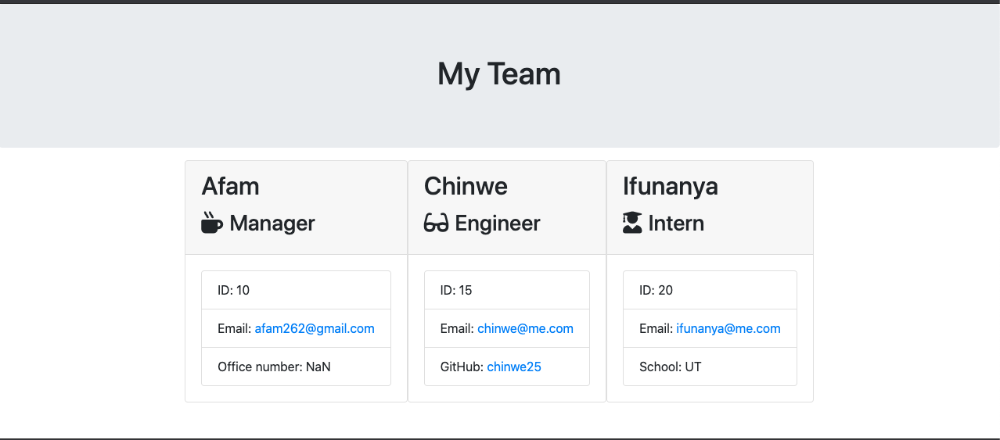

# Employee Summary

 

# Table of Contents  

* [Discription](#discription)
* [Installation](#installation)   
* [Contacts](#contacts)
* [License](#license) 
* [Programming-Language](#programming-language)

## Discription   

This is command-line application that takes in information about employees and generate an HTML webpage that dispalys summaries for each person. These employees will be grouped in teams, each team will consist of one Manager, desired Engineers and intern's. 

## Installation 

1. Clone the repo: https://github.com/Afam-26/ReadMe-Generator.git
2. Install NPM packages: npm install or npm i inquirer
3. To run program: node app.js
4. For unit test, run: npm run test

## Screenshot

[Click here for the video link](https://drive.google.com/file/d/1RcjjD1PbhnY3YUgCnWuKPwj4emH-zcXn/view?usp=sharing)

 
## Contacts Info

Please reach out to me if you have any questions.

Email: afam262@gmail.com

Github Username: https://afam-26.github.io/

[Github link](https://afam-26.github.io/ReadMe-Generator/) 

## Lincense

This Project is licensed by Apache license

[Read more by clicking here!](https://opensource.org/licenses/Apache-2.0)

## Programming-Language 
\`\`\`
Java-Script
\`\`\`